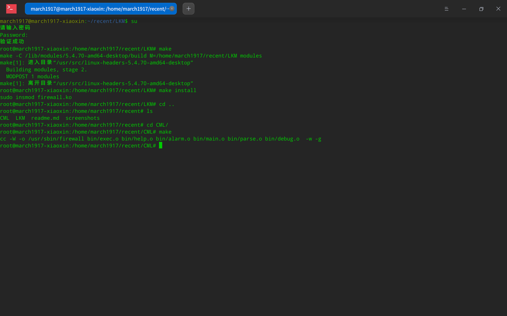
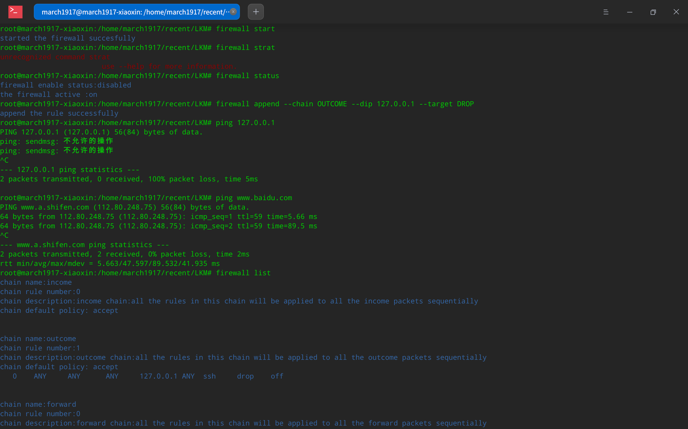
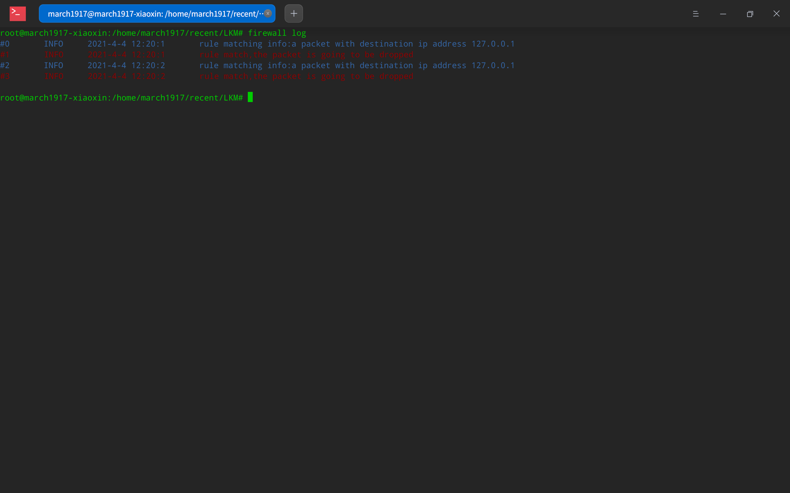
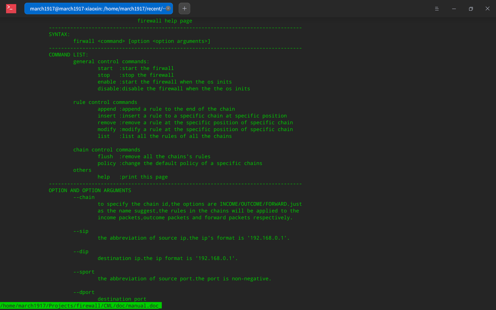

# LINUX FIREWALL

#### 1.Project Introduction

* General description:A linux firewall based on the netfilter apis. You can use it to block the packets of specific source ip/destination ip/source port/destination port/protocol. Besides, it also support a user-friendly log and Start On Boot and other sweet little features.
* Strcture of the project: a linux LKM(loadable kernel modules) and a command line tool which communicate by the proc virtual file.
* Comparasion to UFW and iptables: this firewall is not like ufw which is the iptables. You can consider this project as a reinventing of iptables. And since this, you can use this project as a supplement of iptables and ufw.

#### 2. Requirements

* Linux Kernel: 5.4.70
* Super use access

#### 3. Run

* build the linux kernel module:

  ```shell
  #check the superuser
  su
  
  #check in the LKM directory
  cd LKM/
  
  #build 
  make 
  
  #install the module
  make install
  ```

* build the linux command-line tool

  ```shell
  #check the super user
  su
  #check in the CML directory
  make
  ```

* To use the firewall: here are some basic use of firewall. For more information, please use `firewall help`

  ```shell
  firewall <command> [options]
  #to start and stop
  firewall start 
  firewall stop
  
  #to see the firewall status
  firewall status
  
  #to see all the rules
  firewall list
  
  #to insert a rule
  firewall append --chain INCOME --sip 192.168.1.112 --target DROP
  
  #to see the log
  firewall log
  
  #to enable the firewall
  firewall enable
  
  #to disable the firewall disable
  firewall disable
  ```

#### 4. Screenshots
* Install
	
* Start and Check
	
* Config and Test
	
* Log
	
* Help page
	
